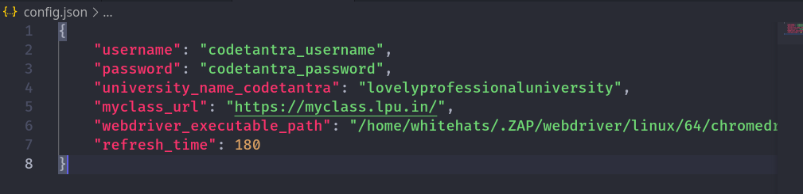
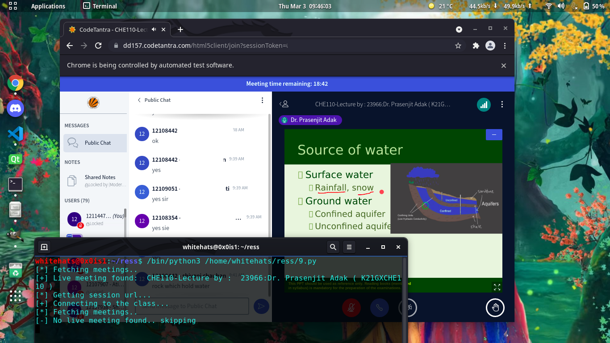

# Codetantra autoscript


[](https://saythanks.io/to/0x0is1)

Automation Script to automatically connect you to codetantra online classes (whenever available) with selenium.

### Installation

```
$ git clone https://github.com/0x0is1/codetantra-autoscript
$ cd codetantra-autoscript
$ python -m pip install -r requirements.txt --user
```
### Setting configuration
* Open [`config.json`](./config.json) file and set up as per your data



**Note: Change it as per your data, else it won't work.**

### Run

```
$ cd codetantra-autoscript
$ python autoscript.py
```

### Preview



### Requirememnts

* Python 3.5+
* Requests-python
* BeautifulSoup-python
* Selenium-python
* Json-python

## Disclaimer

We do not promote any kind of misuse of this tool to get free attendance or any other exploitation. Use it your own risk.

We will definitely take it down if Codetantra wants us to do.

Please contact us through our [Email](mailto:0x0is1@protonmail.com) for such purpose.
## License

This tool is licensed under [The MIT Licence 2022](./LICENSE.md) for free and fair use.
